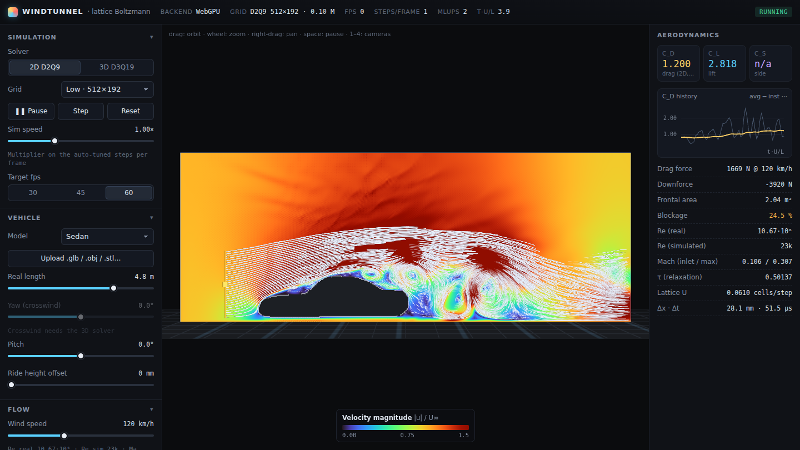
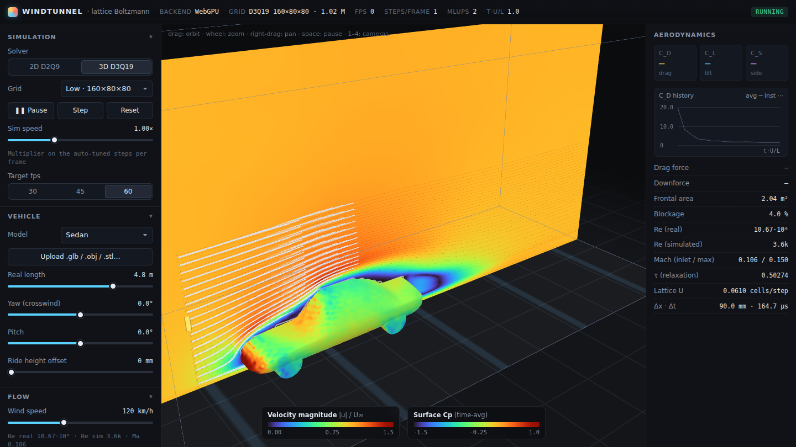

# Windtunnel — a real-time GPU wind tunnel in the browser

An interactive virtual wind tunnel that runs an actual lattice Boltzmann CFD simulation around a
vehicle on the GPU and visualises it live: heatmap slices, surface pressure on the body, 100k+ smoke
tracers, streamlines from a draggable rake, and Q-criterion vortex iso-surfaces. It also reports drag
and lift coefficients from momentum exchange on the body surface.




* **WebGPU compute** (D2Q9 2D and D3Q19 3D) with a **WebGL2 fragment-shader fallback** (2D only)
* Upload any **.glb / .gltf / .obj / .stl**. It is voxelized **on the GPU**, auto-centred, scaled to ⅓ of the
  tunnel length and set on the floor. Procedural presets: sedan, sports car, SUV/van, truck + trailer,
  open-wheel racer, and a sphere and a cylinder for validation
* Yaw (crosswind), pitch and ride height, a moving belt (rolling road), wind speed → Reynolds number
* Built-in **validation suite**: von Kármán street behind a cylinder (Strouhal number), sphere drag,
  free-stream uniformity

## Run it

```bash
npm install
npm run dev          # http://localhost:5173
npm run build        # type-check + static build into dist/
npm run preview      # serve dist/
```

It needs a browser with WebGPU for 3D (Chrome/Edge 113+, or Safari/Firefox with WebGPU enabled). Without
WebGPU the app starts the WebGL2 fallback automatically, and `?webgl` forces it.

### Deploy

The build output is a fully static site (`base: './'`, no server code), so any static host works.

* **Vercel**: import the repo; `vercel.json` already sets `npm run build` → `dist/`. Or run `npx vercel --prod`.
* **GitHub Pages / Netlify / S3**: upload the contents of `dist/`.

## Using it

| | |
|---|---|
| Orbit / zoom / pan | left-drag / wheel / right-drag |
| Cameras | `1` side, `2` top, `3` front, `4` orbit |
| Pause, single step, reset | `Space`, `.`, `R` |
| Screenshot | `P` (PNG with burned-in legend and numbers). "Record video" saves WebM |
| Smoke rake / streamline seeds | drag the yellow handle in the viewport |

URL parameters: `?mode=3d`, `?quality=low|medium|high|ultra`, `?vehicle=f1`, `?webgl`, plus any
setting as `?s.<name>=<value>`, e.g. `?mode=3d&s.isoOn=1&s.field=3`. The names are listed in
[`src/state.ts`](src/state.ts), so a URL can capture a view to share.

## The physics

### Lattice Boltzmann

The solver advances particle distribution functions `fᵢ(x, t)` on a regular lattice. Each cell holds
9 (D2Q9) or 19 (D3Q19) populations moving with discrete velocities `cᵢ`. One time step is a fused
**pull-stream + collide** kernel:

```
fᵢ(x, t+1) = fᵢ*(x − cᵢ, t)                              (streaming, pulled from the upwind neighbour)
fᵢ* = fᵢ^eq + (1 − 1/τ) fᵢ^neq                           (collision)
fᵢ^eq = wᵢ ρ [1 + 3 cᵢ·u + 9/2 (cᵢ·u)² − 3/2 u²]
```

The Chapman–Enskog expansion shows this recovers the (weakly compressible) Navier–Stokes equations
with pressure `p = ρ c_s²`, `c_s = 1/√3`, and kinematic viscosity `ν = (τ − ½)/3`.

**Collision operator.** In the bulk the solver uses *regularized BGK*: `fᵢ^neq` is replaced by its
projection onto the second-order Hermite moment `Π^neq = Σ cᵢcᵢ (fᵢ − fᵢ^eq)`. This removes the
non-hydrodynamic "ghost" modes that make plain BGK blow up as τ → ½. A **Smagorinsky LES** eddy
viscosity is added in closed form from the same tensor,
`τ_eff = ½ (τ₀ + √(τ₀² + 18√2 C_s² |Π^neq| / ρ))`, so the grid can carry flows well beyond the Reynolds
number it could resolve directly. Wall-adjacent cells fall back to plain BGK, because the projection
excites an odd–even mode at bounce-back walls (found and fixed while testing, see
[below](#engineering-notes)).

**Boundaries.**

| boundary | treatment |
|---|---|
| inlet | equilibrium at (ρ = 1, U), plus a thin absorbing layer that damps reflected pressure waves |
| outlet | zero-gradient, plus a viscous sponge over the last 16 % of the tunnel |
| roof, side walls | free slip (specular reflection) |
| floor | free slip, no-slip (halfway bounce-back), or **moving belt**: bounce-back with wall momentum `+6 wᵢ ρ (cᵢ·u_w)` |
| vehicle | halfway bounce-back on the voxelized body |

**Forces.** The force on the body comes from **momentum exchange** across every fluid→solid link:
`F = Σ 2 (fᵢ* − wᵢρ₀) cᵢ`. Subtracting the reference state removes the absolute lattice pressure
`ρ₀c_s²`, which would otherwise act on the tyre contact patches. Then `C_D = F_x / (½ρU²A)` and
`C_L = F_y / (½ρU²A)`, where `A` is the voxelized frontal area in 3D and the frontal height in 2D.

**Derived fields.** Vorticity and the **Q-criterion** `Q = ½(‖Ω‖² − ‖S‖²)` come from central
differences of the velocity field. **Turbulence intensity** is `√(⅓⟨u′·u′⟩)/U`, from exponential
moving averages of `u` and `u·u` that run on the GPU. The same averages feed the time-averaged
heatmaps, the surface Cp and the separation (ū_x < 0) iso-surface.

### Lattice units vs. real-world units

The lattice works in its own units: Δx = Δt = 1, ρ₀ = 1. A run is described by three numbers:

* `L`: reference length in cells (vehicle length ≈ nx/3, or the diameter for validation bodies)
* `U`: inlet speed in cells/step. It is kept at or below 0.1, so the **Mach number** `U/c_s` stays ≤ 0.17
  and the O(Ma²) compressibility error stays around 1–3 %
* `ν`: lattice viscosity, which sets τ

The simulation shares **only the Reynolds number** `Re = U·L/ν` with the real flow. The mapping works
like this:

* **Real Re** = V·L_real/ν_air: 10⁶–10⁷ for a car at road speed.
* **Simulated Re** = real Re × a fixed scale factor, chosen so the top of the speed slider (300 km/h)
  lands on the highest Re the grid can carry stably with LES. Doubling the wind speed therefore
  doubles Re_sim, so the wake visibly changes with speed, but Re_sim stays far below Re_real (roughly
  2·10⁴–10⁵ in 2D and about 10⁴ in 3D). "Override simulated Re" sets Re_sim directly.
* Lattice U also grows with the wind speed (0.035 → 0.1), so faster wind also looks faster.
* **Physical scales**: Δx = L_real / L cells and Δt = (U/V)·Δx, both shown in the HUD.
* **Drag force in newtons**: `F = ½ ρ_air V² C_D A_real`, using the simulated C_D and the real frontal area.
  The frontal area is rasterised from the mesh.

## Validation

Open **Camera & export → Validation suite…** and run the checks. Each case runs on its own solver
instance with analytic geometry, independent of the scene.

| case | setup | expected | measured (this repo, SwiftShader CI run) |
|---|---|---|---|
| Free stream | empty 2D tunnel, 1000 steps | max ‖u‖/U = 1 ± 1 %, ρ = 1 ± 1 % | 1.0000 / 1.0000 ✅ |
| Cylinder Re = 100 | D2Q9, D = 24, 10 % blockage | St = fD/U in 0.16–0.20 (Williamson: 0.166) | St = 0.173 ✅ (D = 18 run, C_D ≈ 1.5) |
| Sphere Re = 100 | D3Q19, D = 20, 3.4 % blockage | C_D = 1.09 ± 20 % (Schiller–Naumann) | 1.34 at D = 10 (coarse test run). Run it at D = 20 in the app |

The cylinder check measures the Strouhal number from upward mean crossings of the lift coefficient
after the transient. The shedding it reproduces is a von Kármán vortex street with the right frequency.

## Known limitations

* **Resolution vs. Reynolds number.** A 256×128×128 grid puts about 85 cells along the car, and the
  boundary layer is not resolved. At Re_sim ≈ 10⁴ the flow is closer to a "large-scale" LES than to
  wall-resolved CFD. C_D values are **qualitative/comparative** and typically read high (for example
  0.5–0.8 for a sedan at the Medium grid, against about 0.3 on the road). Relative changes, such as
  yaw, ride height or shape, are more meaningful than absolute values.
* **Staircase geometry.** Halfway bounce-back on voxels gives first-order geometric accuracy. Curved
  surfaces are stair-stepped, which adds a few percent of drag error at D ≈ 20.
* **Compressibility.** LBM is weakly compressible. Pressure waves exist, and errors scale with Ma². The
  impulsive start is damped (extra viscosity for about one convective time, plus absorbing inlet and
  outlet layers), and the first convective time is left out of the C_D average.
* **Wheels do not rotate.** On the moving belt a small patch of belt around each tyre contact is held
  still. Without that, the belt would ram stagnant fluid into the tyres and add a large spurious drag.
* **2D is a centre-plane slice.** It has no wheels (they are off-plane), no 3D relief, and about 26 %
  blockage because the car height fills a quarter of the tunnel. That makes 2D C_D and C_L much larger
  than real values. Treat them as trends.
* **Stability.** A watchdog catches NaN or local Mach > 0.6. It resets the flow, lowers the lattice speed
  or raises the viscosity, and shows a warning. Extreme Re overrides can still need that.
* **Meshes.** The voxelizer tolerates holes (2-of-3 vote) and overlapping parts (winding numbers).
  Inside-out or badly broken meshes can still fail. Draco-compressed glTF and external `.bin` files are
  not supported, so use a self-contained `.glb`.
* **Precision.** Field textures for rendering are half precision. The solver itself runs in fp32.

## Architecture

See [`docs/ARCHITECTURE.md`](docs/ARCHITECTURE.md) for the data layout, the shader passes, the
voxelizer and the render pipeline. Module map:

```
src/solver/     lattice constants, WGSL generators (stream-collide, macro, reduce, derived), SolverGPU, SolverGL
src/voxelize/   presets, loaders, mesh normalisation/placement, GPU voxelizer + CPU port
src/render/     WebGPU renderer + WGSL, WebGL2/Three.js renderer, colormaps, camera rig, tracers
src/backend/    Backend interface + WebGPU / WebGL2 implementations
src/analysis/   units (lattice ↔ SI), aero coefficients, Strouhal estimator, validation cases
src/ui/         control panel, HUD + C_D chart, legends, validation modal, capture
```

## Engineering notes

A few issues turned up during numerical testing and are fixed in the solver. Each is covered by the
headless test harness (`test.html?case=…`):

1. The **regularized collision at bounce-back walls** excited an odd–even mode that grew into reverse
   flow along the moving belt. The fix is plain BGK on wall-adjacent cells, plus a τ ≥ 0.53 floor on
   belt cells only.
2. A **viscosity floor on the body** had produced a spurious Couette drag through the under-body gap, so
   the floor is now applied to the belt only.
3. **Absolute pressure on tyre contact patches.** The momentum exchange now uses `fᵢ − wᵢρ₀`.
4. **Non-rotating tyres on a moving belt** caused a 4× drag overshoot, which the contact patches fix.

The headless harness runs the solver and voxelizer on SwiftShader (`npm run dev`, then open
`test.html?case=freestream,cylinder,vox`).
